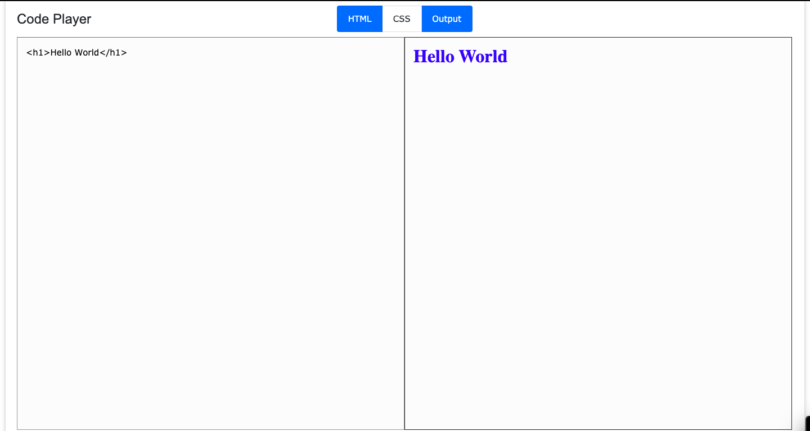
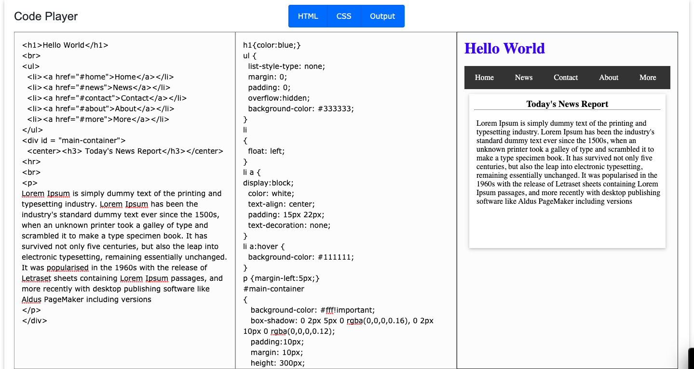

# CodePlayer
Code Player is a webpage that enables users to code Html/CSS and have it display what the code will look like in real time. At launch, the Html
and the Console tab are open but the user can choose to show the CSS tab by clicking on the CSS button at the top. The buttons are highlighted
when the user hovers over them and they stay 'activated' when the user clicks on them. The user can choose to have have none or all of the
tabs open; the tabs resize depending on how many are open.

# What I Learned
* Using $(this).toggleClass() to highlight or activate a class
* Updating an iframe's content with $("iframe").contents().find("html").html()
* Recognizing a user's inputs with $("textarea").on('change keyup paste', function(){});
* Finding how many times a class has been used with $('.hidden').length
* Knowing a div's height or width with $("div").height() or $("div").width()

# Screenshots
* A simple look at the webpage

* An example of what the Code Player can do

